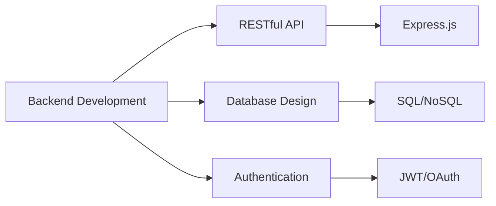

<div align="center">
  
# 👨‍💻 Kağan Sofoğlu

### Backend Developer | Web Developer

[](mailto:kagansofoglu@icloud.com)
[](https://kagansofoglu.tech)
[](https://github.com/1kagan1)

</div>

---

## 🎯 Hakkımda

```typescript
const kagan = {
    age: 18,
    location: "Turkiye 🇹🇷",
    currentFocus: "Backend Development",
    expertise: ["Web Development", "API Design", "Database Management"],
    learning: ["Node.js", "Express", "RESTful APIs", "Database Architecture"],
    interests: ["Clean Code", "Software Architecture", "Problem Solving"],
    website: "kagansofoglu.tech",
    contact: "kagansofoglu@icloud.com"
};
```

---

## 🛠️ Yazılım 

### Backend & Server


### Database


### Frontend Basics


### Tools & Platform


---

## 💼 Çalışma Alanlarım



---

## 📫 İletişim

<div align="center">

**📧 Email:** [kagansofoglu@icloud.com](mailto:kagansofoglu@icloud.com)

**🌐 Website:** [kagansofoglu.tech](https://kagansofoglu.tech)

</div>

---

<div align="center">

### 💭 Favori Söz

*"Türk, öğün, çalış, güven!"* – Atatürk

---


</div>
