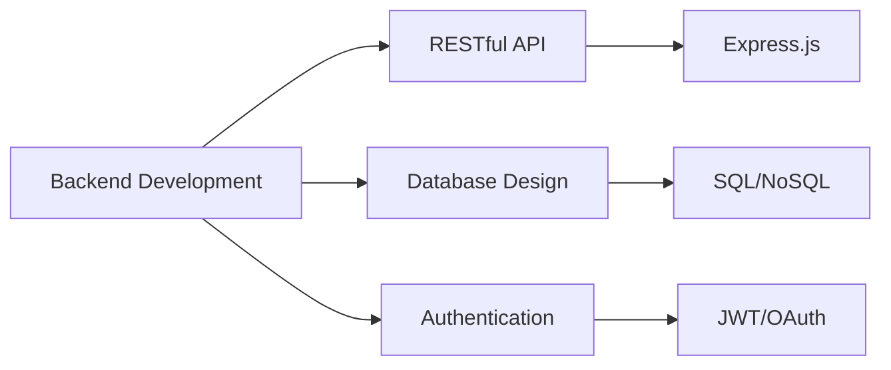

<div align="center">
  
# 👨‍💻 Kağan Sofoğlu

### Backend Developer | Web Enthusiast

[](mailto:kagansofoglu@icloud.com)
[](https://github.com/KULLANICI_ADINIZ)

</div>

---

## 🎯 Hakkımda

```typescript
const kagan = {
    age: 18,
    location: "Turkey 🇹🇷",
    currentFocus: "Backend Development",
    expertise: ["Web Development", "API Design", "Database Management"],
    learning: ["Node.js", "Express", "RESTful APIs", "Database Architecture"],
    interests: ["Clean Code", "Software Architecture", "Problem Solving"],
    contact: "kagansofoglu@icloud.com"
};
```

> 💡 **Tutkum:** Backend teknolojileri ve ölçeklenebilir sistemler geliştirmek

---

## 🛠️ Teknoloji Yığınım

### Backend & Server


### Database


### Frontend Basics


### Tools & Platform


---

## 📊 GitHub Metrikleri

<div align="center">
  
[](https://github.com/KULLANICI_ADINIZ)

[](https://github.com/KULLANICI_ADINIZ)

[](https://github.com/KULLANICI_ADINIZ)

</div>

---

## 🚀 Öne Çıkan Projeler

<div align="center">

[](https://github.com/KULLANICI_ADINIZ/PROJE_ADI)

[](https://github.com/KULLANICI_ADINIZ/PROJE_ADI_2)

</div>

---

## 💼 Çalışma Alanlarım



---

## 🎓 Öğrenme Yolculuğum

- ✅ Web Development Fundamentals
- ✅ JavaScript & ES6+
- 🔄 Backend Architecture & Design Patterns
- 🔄 Database Optimization
- 📋 Microservices Architecture
- 📋 DevOps & Cloud Services

---

## 📫 İletişim

<div align="center">

**📧 Email:** [kagansofoglu@icloud.com](mailto:kagansofoglu@icloud.com)

[](https://linkedin.com/in/PROFILINIZ)
[](https://twitter.com/KULLANICIADI)
[](https://SITENIZ.com)

*Eğer sosyal medya hesaplarınız yoksa yukarıdaki satırları silebilirsiniz*

</div>

---

<div align="center">

### 💭 Favori Söz

*"Code is like humor. When you have to explain it, it's bad."* – Cory House

---


**⭐ Projelerimi beğendiyseniz yıldızlamayı unutmayın!**

</div>
